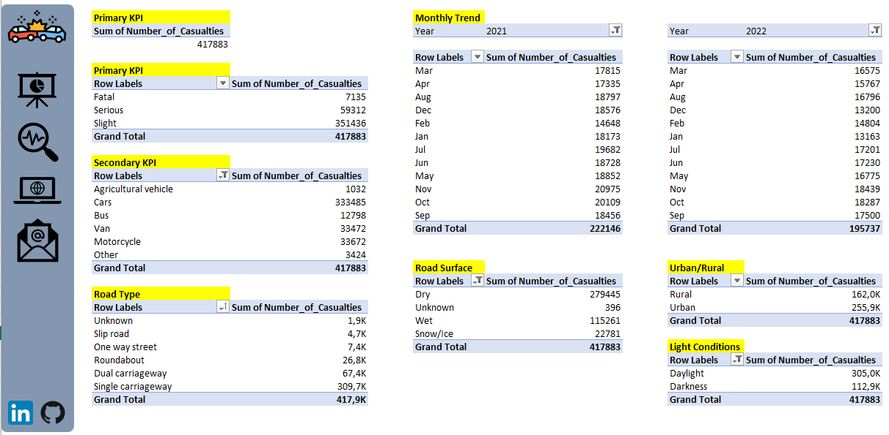

# Road Accidents

<h2>Table of Contents</h2>

- [Project Overview](#project-overview)
- [Data Source](#data-source)
- [Tools](#tools)
- [Project Walkthrough](#project-walkthrough)

<h2>Project Overview</h2>
This project aimed to analyze road traffic accidents that occurred in the Great Britain during the years 2021 and 2022. The primary focus was on creating an interactive dashboard using Excel to provide insights into the accident data.

** Primary Key Performance Indicators (KPIs): **
- Total Casualties after Accident
- Total Casualties by Accident Severity
- Percentage of Total Casualties by Severity
- Maximum Casualties by Type of Vehicle

**Secondary Key Performance Indicators (KPIs):**
- Total Casualties by Vehicle Type
- Monthly Trend Comparison (2021 vs. 2022)
- Maximum Casualties by Road Type
- Distribution of Total Casualties by Road Surface
- Relation between Casualties, Area, and Light Conditions

The file consist of 8 tabs: Dataset, KPIs, Monthly Trend, Road Type, Road Surface, Area and Light, Dashboard, Data Analysis.

<h2>Data Source</h2>
The dataset used in this project is the "Dataset" sheet in "Road_Accidents.xlsx" file.

<h2>Tools</h2>

- Microsoft Excel

<h2>Project Walkthrough</h2>

**1. Data Cleaning:**
   - Correction of misspellings
   - Filling blank cells with "Unknown"

**2. Data Processing:**
   - Adding "Month" column and extracting month name from "Accident Date" column using TEXT function
   - Adding "Year" column and extracting year from "Accident Date" column using TEXT function

**3. Data Analysis**

- Creating Pivot Tables in tabs named according to the analyzed KPIs ("Primary KPIs", "Monthly Trend", "Road Type", "Road Surface", "Area and Light" tab). Additionally, all created Pivot Tables were summarized in "Data Analysis" tab.
    

- Calculating percentage of Fatal, Serious and Slight Casualties.
- Creating calculated items within a Pivot Table to calculate Total Casualties by Car Type.
- 
