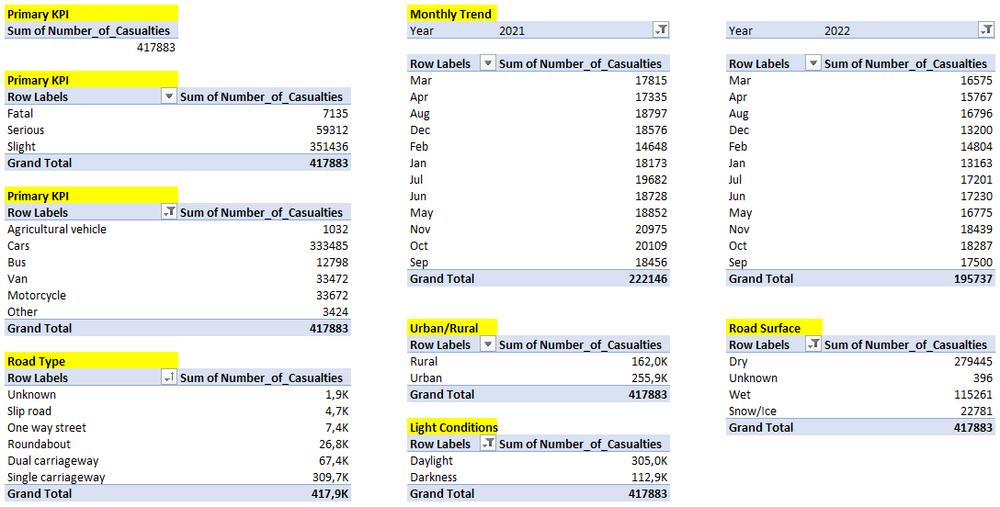
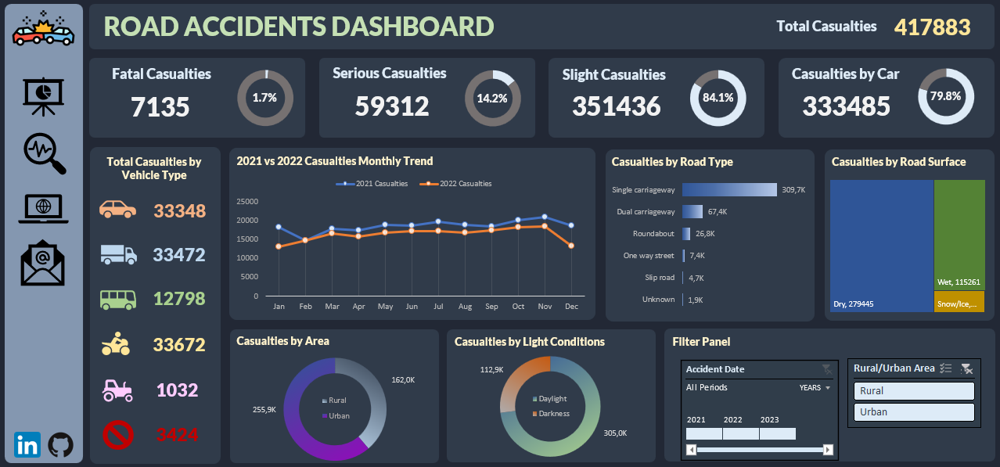

# Road Accidents

<h2>Table of Contents</h2>

- [Project Overview](#project-overview)
- [Problem Statement](#problem-statement)
- [Data Source](#data-source)
- [Tools](#tools)
- [Project Walkthrough](#project-walkthrough)

<h2>Project Overview</h2>
This project aimed to analyze road traffic accidents that occurred in the Great Britain during the years 2021 and 2022. The primary focus was on creating an interactive dashboard using Excel to provide insights into the accident data. The file consist of 8 tabs: Dataset, KPIs, Monthly Trend, Road Type, Road Surface, Area and Light, Dashboard, Data Analysis.

<h2>Problem Statement</h2>

** Primary Key Performance Indicators (KPIs): **
- What is the number of total casualties after accident?
- What is the number of total casualties by accident severity?
- What is the percentage of total casualties by severity?
- What is the maximum casualties by the type of vehicle?

**Secondary Key Performance Indicators (KPIs):**
- What is the number of total casualties by vehicle type?
- What is the monthly trend (2021 vs. 2022)?
- What is the maximum casualties by road type?
- What is the distribution of total casualties by road Surface?
- What is the relation between casualties, area, and light conditions?

<h2>Data Source</h2>
The dataset used in this project is the "Dataset" sheet in "Road_Accidents.xlsx" file.

<h2>Tools</h2>

- Microsoft Excel

<h2>Project Walkthrough</h2>

**1. Data Cleaning:**
   - Correction of misspellings.
   - Filling blank cells with "Unknown".

**2. Data Processing:**
   - Adding "Month" column and extracting month name from "Accident Date" column using TEXT function.
   - Adding "Year" column and extracting year from "Accident Date" column using TEXT function.

**3. Data Analysis**

- Creating Pivot Tables in tabs named according to the analyzed KPIs ("Primary KPIs", "Monthly Trend", "Road Type", "Road Surface", "Area and Light" tab). Additionally, all created Pivot Tables were summarized in "Data Analysis" tab.
    

- Calculating percentage of Fatal, Serious and Slight Casualties.
- Creating calculated items within the Pivot Table to calculate Total Casualties by Car Type (car, bus, van, motorcycle, agricultural vehicle, other) and calculating percentage of Total Casualties by Car.
- Creating calculated items within the Pivot Table to calculate Total Casualties by Road Surface (dry, wet, snow/ice, unknown).
- Creating calculated items within the Pivot Table to calculate Total Casualties by Light Conditions (daylight, darkness).
- Introducing a timeline and a slicer (Rural/Urban Area).

**3. Data Visualization**

- Developing donut charts representing the percentage of fatal, serious, slight casualties and casualties by car.
- Creating a line chart for monthly trend in 2021 and 2022.
- Creating a pivot chart (bar chart) representing casualties by road type.
- Creating a treemap representing the number of casualties by road surface.
- Creating pivot charts (donut charts) representing the number of casualties by area and light conditions.
- Dashboard building.

**User Interface:**

- Filter Panel was created for the timeline and slicer with hovering effect to display filtered data from 2021, 2022, rural and urban area.
- Navigation Panel on the left side of the dashboard contains clickable black icons that navigate to "Dashboatd" tab, "Data Analysis" tab, "Reported Road Casualties Great Britain" Wikipedia website and e-mail. Additionally there are two icons at the botton of this panel that navigate to my LinkedIn and Githup profiles.
